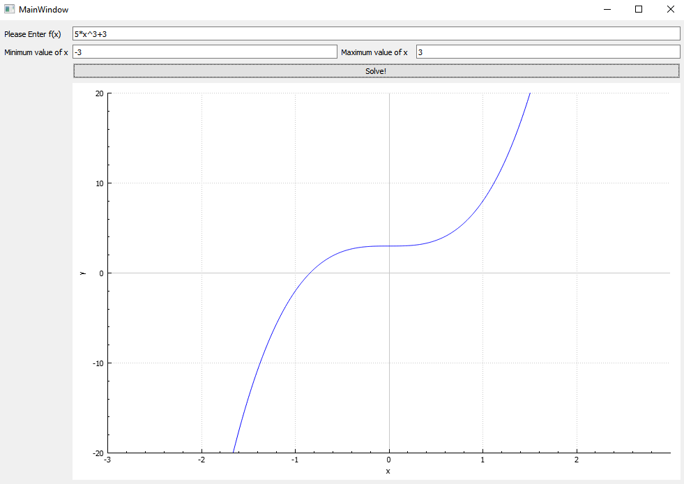
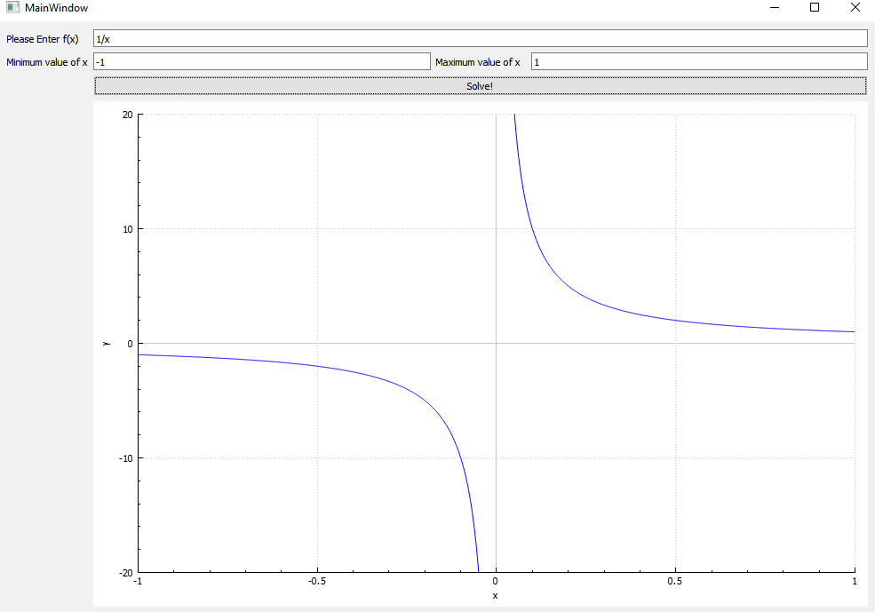

# Welcome to Function-Plotter!

Simple C++/Qt Program that plot your function

# Supported Functions

## Plotting any equation in range of (min,max) values

linear equation

equation of 2nd order

equation of 3rd order

rational equation

